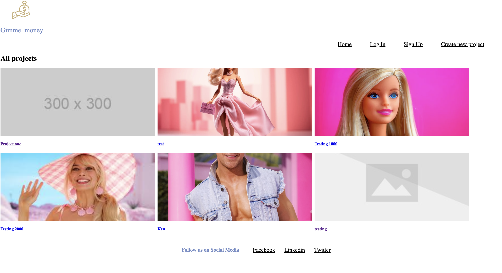
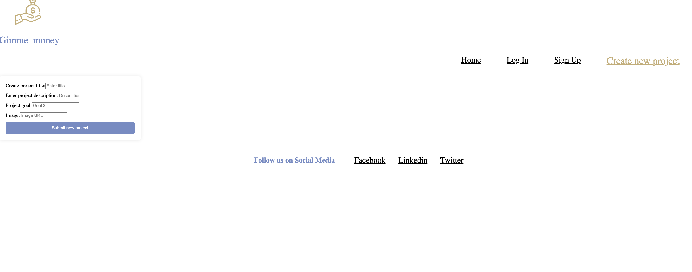
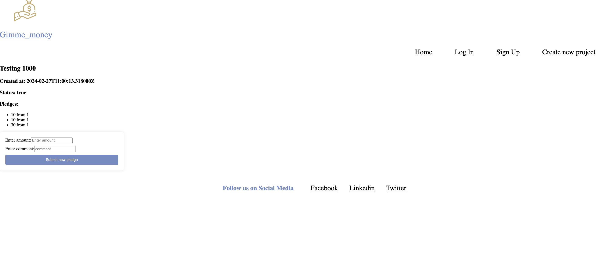

- [ ] A link to the deployed project. https://dainty-kulfi-129d88.netlify.app/
- [ ] A screenshot of the homepage.

- [ ] A screenshot of the project creation page

- [ ] A screenshot of the project creation form
    the same as above
- [ ] A screenshot of a project with pledges

[ ] A screenshot of the resulting page when an unauthorized user attempts to edita project (optional, depending on whether or not this functionality makes sense inyour app!)
